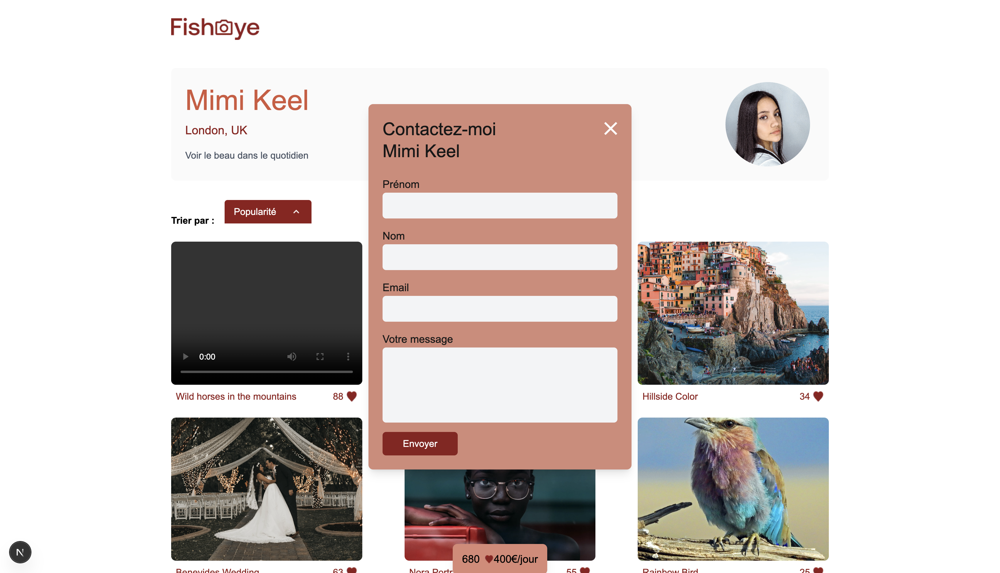

# P9_Fisheye -  Plateforme de photographes

Fisheye est une plateforme web permettant de découvrir des photographes et leurs œuvres, avec une expérience utilisateur riche incluant tri, likes et modales interactives.

---

## Fonctionnalités

### Page d’accueil
- Liste des photographes avec leurs informations principales (nom, ville, pays, tagline, prix).
- Possibilité de naviguer vers la page détaillée d’un photographe.
- Tri et filtrage des photographes selon différents critères.  


---

### Page photographe
- Affichage de tous les médias (photos et vidéos) du photographe.
- Tri des médias par **Popularité**, **Date** ou **Titre** grâce au composant `Dropdown`.
- Incrémentation dynamique des **likes** pour chaque média, avec mise à jour du total visible dans l’encart en bas de page.
- Modal carousel pour visualiser les médias en grand format avec navigation flèches et gestion des likes.

  

---

### Modal contact
- Ouverture d’une modal pour contacter le photographe.
- Gestion de l’accessibilité et fermeture via bouton ou clic en dehors.
- Changement visuel du bouton au hover et focus.



---

### Modal galerie
- Visualisation en plein écran des médias du photographe.
- Navigation entre les médias avec flèches gauche/droite.
- Gestion des likes directement depuis la modal.
- Fermeture avec la croix ou la touche `Escape`.


---

## Technologies utilisées

- **Frontend :** Next.js, React, TypeScript
- **Styling :** TailwindCSS
- **Backend :** Prisma + SQLite
- **Autres :** Fetch API, gestion des routes API pour incrémentation des likes

---

## Installation

1. Cloner le projet :
```bash
git clone <https://github.com/hNnicolas/P9_FishEye/tree/main/frontend>
cd frontend


